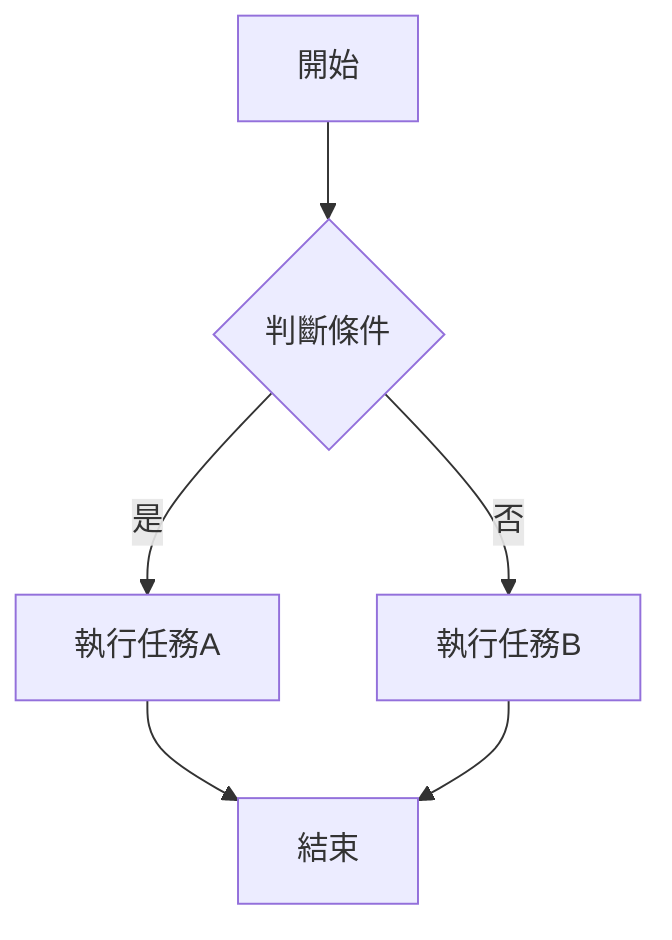
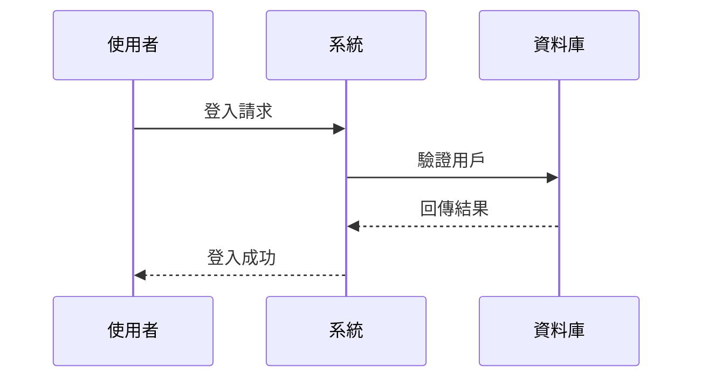
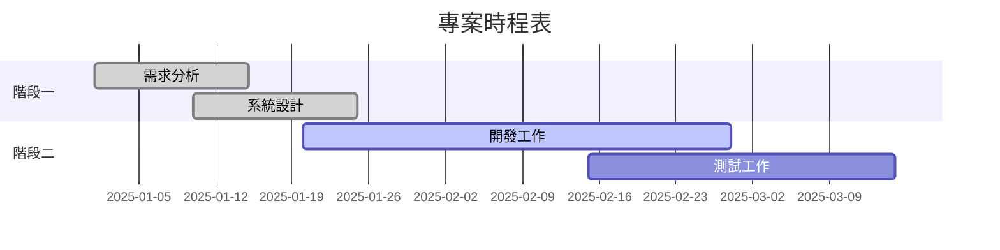
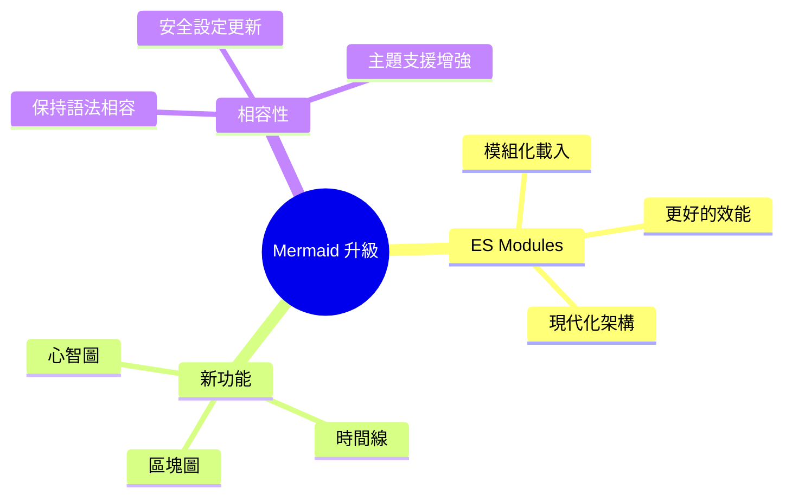
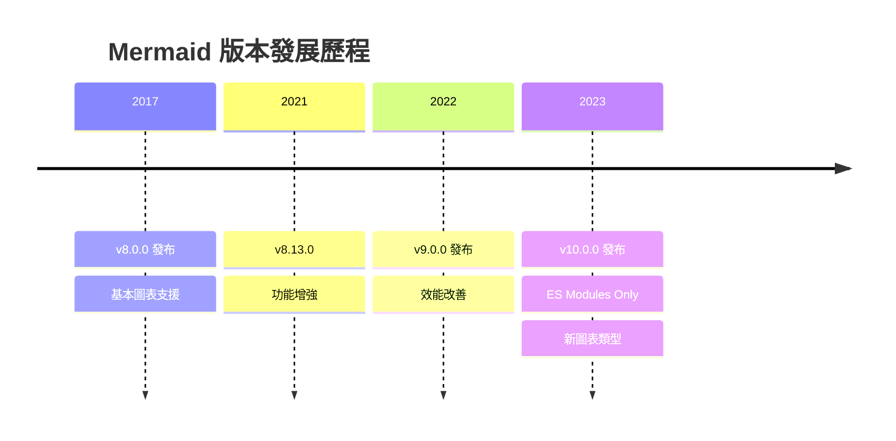
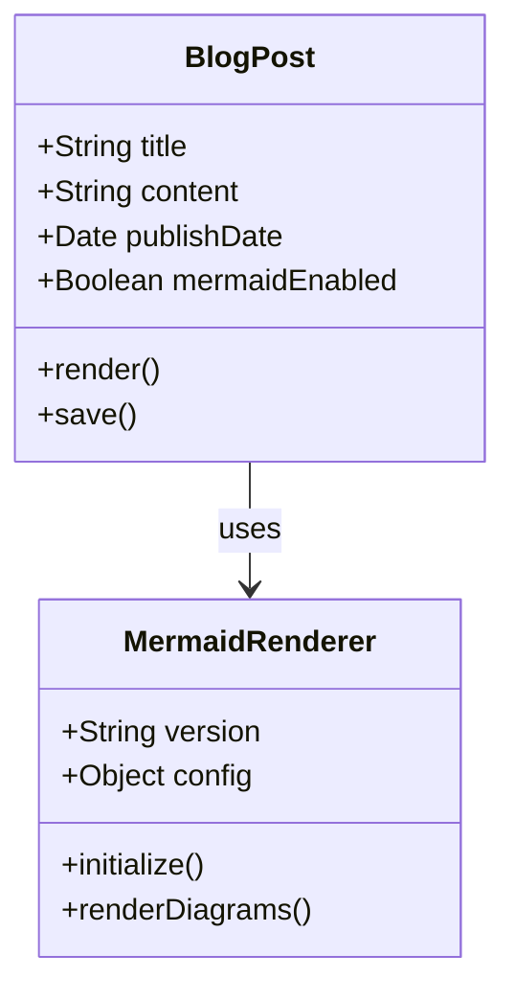

## Mermaid 10.9.0 功能測試

本文測試從 Mermaid 8.0.0 升級到 10.9.0 後的各項功能，並驗證深色模式自動適配。

### 基本流程圖測試

### 序列圖測試

### 甘特圖測試

### 新功能：心智圖 (v10+ 新增)

### 新功能：時間線 (v10+ 新增)

### 類別圖測試

## 升級重點總結

### 版本變更
- **從版本**: Mermaid 8.0.0（forest 主題）
- **升級到**: Mermaid 10.9.0（自動深色模式適配）

### 架構改進
1. **統一管理**: 通過 `_includes/mermaid.html` 集中處理所有配置
2. **版本控制**: 在 `_config.yml` 中設定 `mermaid_version: "10.9.0"`
3. **主題適配**: 根據 `default_theme: "dark"` 自動選擇深色/淺色主題
4. **動態切換**: 提供 `updateMermaidTheme(isDark)` 全域函數

### 技術特色
- **自動載入**: `startOnLoad: true` 頁面載入時自動初始化
- **安全設定**: `securityLevel: 'loose'` 保持相容性
- **新圖表類型**: 心智圖、時間線、區塊圖等 v10+ 新功能
- **深色模式**: 在深色主題下自動使用 `theme: 'dark'`

### 深色模式測試
本頁面的所有圖表應該：
- ✅ 在深色模式下顯示深色主題圖表
- ✅ 保持良好的可讀性和對比度
- ✅ 支援所有圖表類型（流程圖、序列圖、甘特圖、心智圖、時間線、類別圖）

如果本頁面的所有圖表都能正常顯示且主題適配正確，表示升級成功！